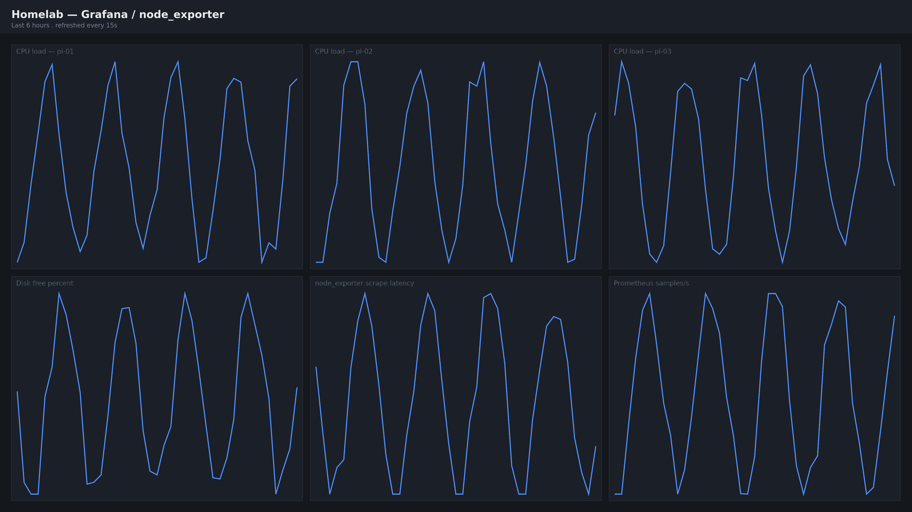

## The dashboard

Six panels, captured at native 4K — the Grafana board this site's own
`node_exporter` setup would produce. `kind="screenshot"` (§14.1): sits on
`--c-sunken` with a rule border, and stays undimmed in dark mode, unlike a
diagram or a photo.

:::figure{kind="screenshot"}

Fig. 1 — The board `pi-01`'s Grafana serves, captured at its native
3840×2160 — `astro:assets` is what turns this into a 780w source for the
measure column rather than shipping the 4K file itself.
:::
